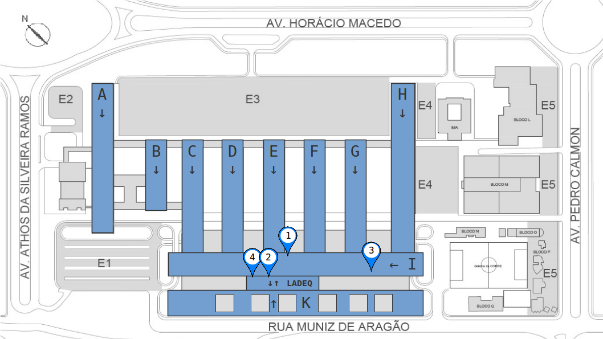

Contact {#contact}
=======

@htmlonly
<html>
<meta name="viewport" content="width=device-width, initial-scale=1">
<link rel="stylesheet" href="https://www.w3schools.com/w3cs
s/4/w3.css">
<body>

  

      <h2 style="font-size:20px;"><b>Management email address</b></h2>
       
E-mail: atoms@eq.ufrj.br

       
      <h2 style="font-size:20px;"><b>Project Management Assistant</b></h2>
       
Nathália Cerqueira Ribeiro

       
E-mail: nribeiro@peq.coppe.ufrj.br

       
      <h2 style="font-size:20px;"><b>Research Assistant</b></h2>
       
Amanda Gerhardt de Oliveira Ferreira

       
E-mail: agerhardt@peq.coppe.ufrj.br

       
  

  
  

      <h2 style="font-size:20px;"><b>Local Address</b></h2>
       
 Av. Athos da Silveira, n° 149, Centro de Tecnologia 

       
 Cidade Universitária, Rio de Janeiro, RJ, Brasil 

       
 Postal Code: 21941-909

       
  <table>
  <tr>
    <td style="width:49%" align="left">
       
 <b>[Lab 1]</b> Bloco I, Sala I-224  

       
 <b>[Lab 3]</b> Bloco I, Sala I-142  

       
 <b>[Lab 5]</b> Bloco M 

    </td>

    <td style="width:2%" align="left">
    </td>    
    
    <td style="width:49%" align="left">
       
 <b>[Lab 2]</b> LADEQ, 2o piso  
 
       
 <b>[Lab 4]</b> LADEQ, 3o piso  

       
   

    </td>  
  </table>
       
  

  
  

      <h2 style="font-size:20px;"><b>Phone Number</b></h2>
       
+55 21 3938 7428 (Nathália, Sala I-224)
  
      <h2 style="font-size:20px;"><b>Facebook page</b></h2> 
      
 <a href="https://www.facebook.com/atoms.ufrj">facebook.com/atoms.ufrj</a> 

      <h2 style="font-size:20px;"><b>Instagram page</b></h2> 
       
 <a href="https://www.instagram.com/atoms.ufrj">instagram.com/atoms.ufrj</a> 

      <h2 style="font-size:20px;"><b>Youtube channel</b></h2> 
       
 <a href="https://www.youtube.com/c/atoms-ufrj">youtube.com/c/atoms-ufrj</a> 

  

  

</body>
</html>       
@endhtmlonly

@htmlonly
<html>
<meta name="viewport" content="width=device-width, initial-scale=1">
<link rel="stylesheet" href="https://www.w3schools.com/w3cs
s/4/w3.css">
<body>

  

    Interactive map for access points and parking lots for route calculations
    <iframe src="https://www.google.com/maps/d/u/0/embed?mid=1agRyKmDNRED6hjSCKb9Fos4-apLnIBRl" width="100%" height="480"></iframe>
  

  

    Internal Technology Center orientation map
    
  

</body>
</html>       
@endhtmlonly
