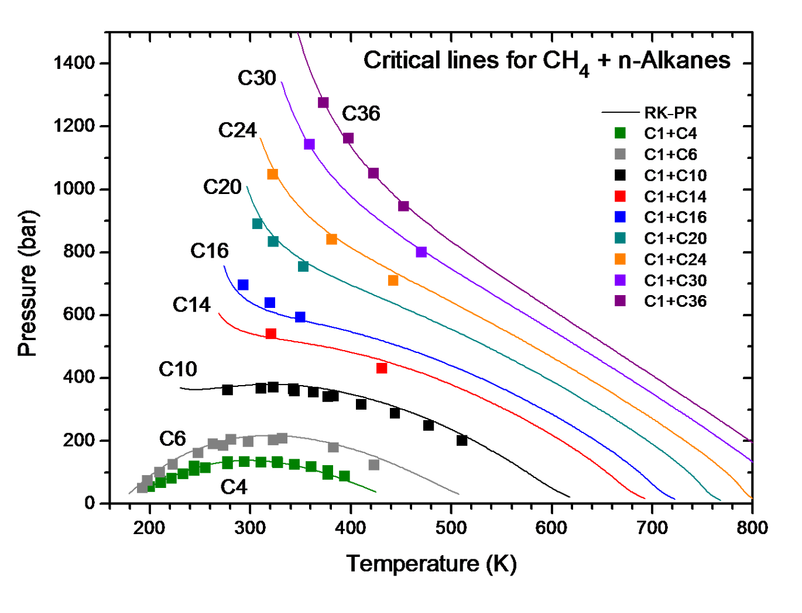
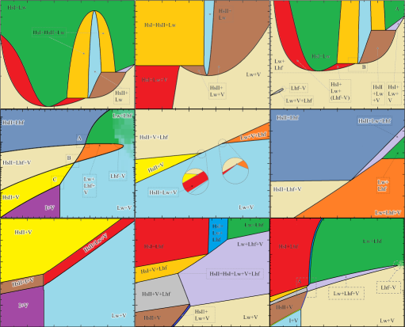
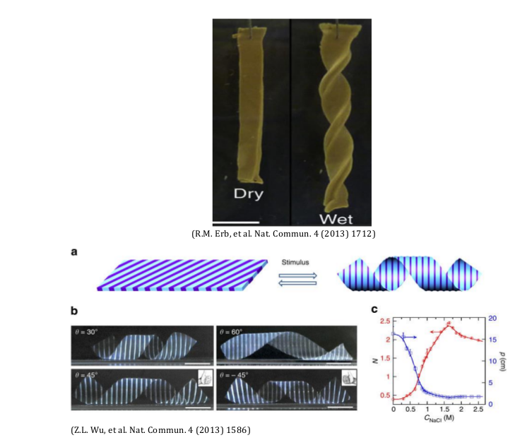
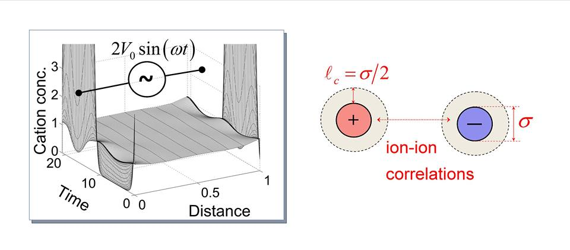
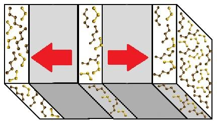
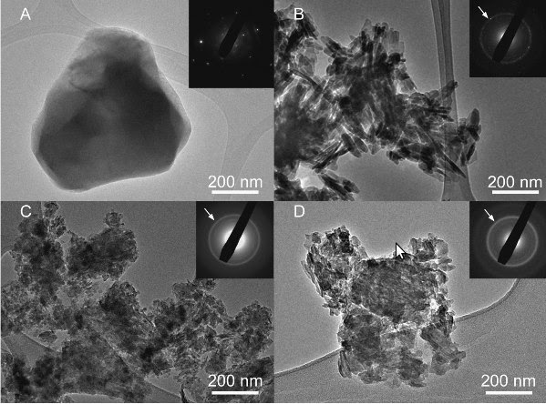
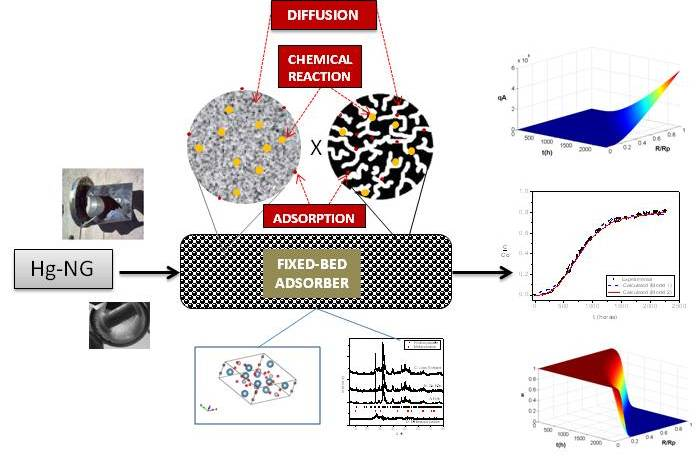
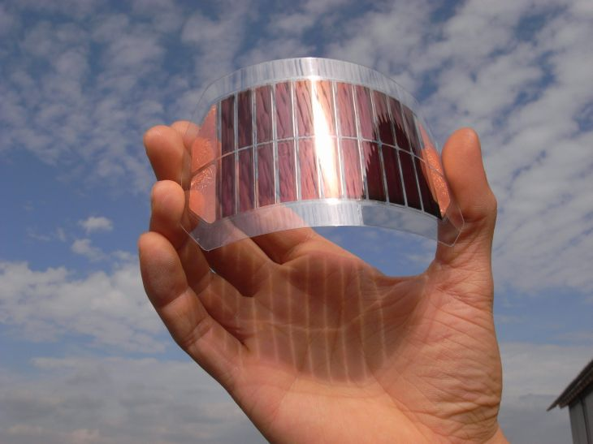
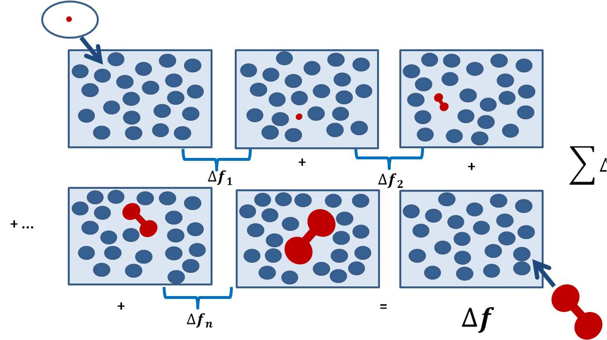
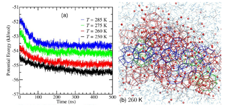

Events {#events}
======

----------------------------------------------------------------------------------------------------
ATOMS Seminar: Equations of State in Three Centuries - What have we learned? What more needs to be done?
----------------------------------------------------------------------------------------------------

    Prof. Georgios M. Kontogeorgis
    Technical University of Denmark
    Department of Chemical and Biochemical Engineering
    Center for Energy Resources Engineering (CERE), Kgs
    Lyngby, Denmark

* __Date__: February 27, 2015
* __Time__: 11:00 am
* __Location__: Room G-119

140 years have elapsed since van der Waals proposed his now famous equation of state (EoS) which
bears his name. During the first 100 years since van der Waals, research and applications were
dominated by the cubic EoS, of which the most well-known are the Soave-Redlich-Kwong and
Peng-Robinson ones. During the 80's and 90's were some of the most important improvements in this
context the development of the advanced EoS/GE mixing rules (Huron-Vidal, MHV2, PSRK, Wong-Sandler,
LCVM,...), where explicit activity coefficient models are implemented in the cubic equation of state
via advanced mixing rules. Cubic EoS either with the classical or with the EoS/GE mixing rules
have found widespread industrial applications in the petroleum and chemical industries.

In parallel, non-cubic equations of state were already available in the 70's and 80's, many
developed based on chemical, quasi-chemical (lattice) or perturbation theories; for a review see
the recent textbooks. The degree of sophistication of these models is high, as are the expectations
about their performance! Only if clearly better than cubic EoS could these advanced models be
adopted for practical applications. A major breakthrough came in the late 80's with the advent of
the SAFT theory (Statistical Associating Fluid Theory), which has resulted by now in a large number
of variants. Differences between the various SAFT variants are not always clear, from the
practical-application point of view. Nevertheless, SAFT models have by now been applied to a wide
range of systems, ranging from those of interest to oil & gas and chemicals up to pharmaceuticals,
electrolytes and polymers. Their applications are not restricted to phase equilibria and include
other properties as well (e.g. derivative and thermal ones) as well as interfacial & adsorption
phenomena.

Following a short introduction on the history of equations of state during the last three centuries,
the main purpose of this lecture is to address the following questions:
* What are the capabilities and limitations of equations of state as we know them today?
* How does the performance of cubic and non-cubic EoS compare to each other?
* What is the true application spectrum of cubic and non-cubic EoS (in terms of systems and
properties)?
* Where do we stand today and what have we learnt from 140 research with equations of state?
* What are the future challenges and what can we expect that the future will bring?

----------------------------------------------------------------------------------------------------
ATOMS Seminar: Termodinámica de Fluidos desde Córdoba y perspectivas de colaboración com el grupo ATOMS
----------------------------------------------------------------------------------------------------

    Martín Cismondi Duarte
    Professor Associado de Engenharia Química
    Investigador Adjunto (PLAPIQUI - CONICET)
    Universidade Nacional de Córdoba - Argentina

* __Date__: December 5, 2014 
* __Time__: 12:00 pm 
* __Location__: Room I-222 (Ipê)

Esse seminário pretende mostrar as linhas atuais de pesquisa do grupo ao que pertenço na Argentina
(IDTQ, Córdoba), focando no modelado de misturas de alcanos e software desenvolvido. Estou na UFRJ
como pesquisador convidado em um projeto Petrobras. Assim, através do seminário espero ampliar minha
interação com o grupo todo e a partir das discussões que surgirem poder definir futuros seminários
para o próximo ano.

----------------------------------------------------------------------------------------------------
Thesis Defense: Multiphase Flash Calculation with Simultaneous Stability Analysis Including Hydrates
----------------------------------------------------------------------------------------------------

    Iuri Soter Viana Segtovich
    TPQB / EQ / UFRJ

* __Date__: December 1, 2014
* __Time__: 9:00 am
* __Location__: Room E-205

----------------------------------------------------------------------------------------------------
ATOMS Seminar: Teorias do contínuo para mudanças de forma em géis poliméricos
----------------------------------------------------------------------------------------------------

    Fernando Pereira Duda
    Programa de Engenharia Mecânica
    COPPE/UFRJ

* __Date__: November 28, 2014
* __Time__: 12:00 pm
* __Location__: Room G-119

Um gel, entendido como uma rede polimérica reticulada embebida em um solvente, responde a ações
externas mudando a sua forma e sua composição através dos processos de deformação da rede e
permeação do solvente. Estes processos são acoplados entre si devido a deformação induzida pelo
solvente (intumescimento) e, adicionalmente, podem sofrer a influência de efeitos mecânicos,
térmicos, químicos, elétricos, e magnéticos, entre outros. Essas características do comportamento de
géis poliméricos devem ser ponderadas durante o desenvolvimento/seleção de qualquer teoria. Neste
seminário serão abordados os seguintes pontos relacionados com teorias do contínuo para interação
entre mudanças de forma e composição em géis poliméricos: i) desafios, desenvolvimentos recentes e
novas ideias; ii) aplicações no estudo da geração e controle de forma em géis naturais e sintéticos.

----------------------------------------------------------------------------------------------------
Thesis Defense: Dynamics of Ions in Solution: Size and Electrostatic Correlation Effects
----------------------------------------------------------------------------------------------------

    Pedro Henrique Rodrigues Alijó
    PEQ / COPPE / UFRJ

* __Date__: Monday, Nov 24, 2014
* __Time__: 8:00 am
* __Location__: Room G-119

----------------------------------------------------------------------------------------------------
Qualifying Exam: Determinação Experimental e via Simulação Molecular em Não Equilíbrio dos coeficientes de termodifusão de misturas
----------------------------------------------------------------------------------------------------

    Filipe Arantes Furtado
    PEQ / COPPE / UFRJ

* __Date__: Friday, Oct 31, 2014
* __Time__: 9:00 am
* __Location__: Room G-119

----------------------------------------------------------------------------------------------------
ATOMS Seminar: Biomateriais e Biomineralização: Pesquisa Fundamental e Aplicações Biomédicas
----------------------------------------------------------------------------------------------------

    André Linhares Rossi
    Programa de Ciências Morfológicas - PCM/UFRJ
    Pesquisador do Centro Brasileiro de Pesquisas Físicas - CBPF

* __Date__: October 17, 2014
* __Time__: 12:00 pm
* __Location__: Room G-119

A bioengenharia de tecido ósseo busca otimizar em tempo e espaço a regeneração do osso, buscando
criar condições ideais para o reparo e a substituição de tecidos lesados. Os fosfatos de cálcio são
comumente usados como implantes ósseos por serem biocompatíveis e osteocondutores. Neste seminário,
serão apresentados estudos sobre a nanoestrutura de biomateriais de fosfato de cálcio usando a
técnica de Microscopia Eletrônica de Transmissão (MET) de alta resolução. Três temas serão
abordados: 1) interface material/osso; 2) Efeito do estrôncio na parte mineral do osso; 3) processo
de formação de filmes finos de fosfato de cálcio por magnetron sputtering. Além disso, o palestrante
fará uma breve exposição sobre os potenciais do MET para a caracterização de materiais na escala
nanométrica.

----------------------------------------------------------------------------------------------------
ATOMS Seminar: Use of hydroxylapatite-based sorbents for mercury removal from natural gas: a focus on the Hg stabilization
----------------------------------------------------------------------------------------------------

    Carla Manske Camargo
    PEQ / COPPE / UFRJ

* __Date__: October 10, 2014
* __Time__: 12:00 pm
* __Location__: Room G-119

Mercury is a toxic and bioaccumulative global pollutant. The standards of its control are
increasingly restrictive motivating the development of new removal technologies. Adsorption process
is an important process to mercury capture from gaseous streams with low Hg0 concentrations, for
example natural gas. Beyond of the hazards related to the mercury exposure, Hg0 is also associated
with serious failures on natural gas plants by corrosion of equipments and structures. In the
present study, hydroxylapatite-based sorbents modified with metal sulfides were tested as sorbents
with both high mercury affinity and stabilization capacity. These characteristics were investigated
in dynamic and static Hg0 adsorption, lixiviation, and thermal stability tests. In the mathematical
modeling approach, a chemical Hg fixation term was added to classic fixed-bed adsorption models. The
chemical reaction mechanism for mercury fixation was supported by X-Ray Diffraction results. The
experimental results have proven the mercury stabilization capacity of tested sorbents even under
severe conditions of temperature and pH. The proposed mathematical model, with its optimized
parameters, was used to study the dynamic behavior of a fixed bed adsorption process at different
simulated operational conditions. Simulation results show that the chemical fixation of mercury
inside the solid matrix leads to an increase of mercury removal capacity and reduces the risk of
mercury re-emission after used sorbent disposal.

----------------------------------------------------------------------------------------------------
ATOMS Seminar: Fotovoltaicos orgânicos: desafios na simulação dos estados excitados de poliparafenilenovinilenos (PPV)
----------------------------------------------------------------------------------------------------

    Prof. Thiago Cardozo
    Departamento de Fisico-Química
    Instituto de Química - UFRJ

* __Date__: September 25, 2014
* __Time__: 12:00 pm
* __Location__: Room E-205

A busca por fontes alternativas de energia tem se intensificado devido às preocupações crescentes
com o volume de gases estufa gerados pela sociedade. Os fotovoltaicos orgânicos têm recebido atenção
especial por seu potencial baixo custo e relativa facilidade de customização e produção. A
eficiência de fotovoltaicos orgânicos é ainda baixa, e vários mecanismos de perda de energia nesses
sistemas ainda não foram elucidados.

Estudos teóricos desses sistemas esbarram em obstáculos associados à necessidade de modelos de alto
nível para a descrição dos estados excitados envolvidos no processo de geração de eletricidade após
absorção de luz e do tamanho dos sistemas de interesse, que tornam o uso de tais modelos proibitivo
do ponto de vista computacional.

Nessa apresentação, alguns resultados referentes à modelagem de estados excitados de oligômeros de
PPV serão discutidos, bem como as suas consequências para a compreensão desses sistemas e os
desafios restantes.

----------------------------------------------------------------------------------------------------
Qualifying Exam: Molecular Simulation of Rigid Molecules Aiming at Improving the COSMO-SAC Model
----------------------------------------------------------------------------------------------------

    Jéssica Caroline da Silva Linhares Maciel
    PEQ / COPPE / UFRJ

* __Date__: Friday, Sept 26, 2014
* __Time__: 9:00 am
* __Location__: Room E-205

----------------------------------------------------------------------------------------------------
ATOMS Seminar: Molecular Structures in Petroleum Fluids mad Petroleum Fluid-Rock Systems in Relation to Efficient Hydrocarbon Production and Recovery
----------------------------------------------------------------------------------------------------

    Professor Abbas Firoozabadi
    RERI and Yale University

* __Date__: September 18, 2014
* __Time__: 1:00 pm
* __Location__: Room E-205

Molecules in petroleum fluids and in petroleum fluid-rock systems aggregate. The inhomogeneity and
aggregation of different molecules have profound effect on hydrocarbon energy production and on
improved recovery. The changes in the fluid structures can often realize by addition of small
amounts of functionalized molecules resulting in drastic efficiency and safety of hydrocarbon energy
production. Improved oil and gas recovery can be achieved by changes in fluid structure and rock
surfaces using small amounts of surfactants and ionic liquids. We need to design these
functionalized molecules for specific needs. Our models may account for quantum effects to atomistic
level considerations.

This presentation will be divided into two parts. In the first part of the presentation I will
discuss some of flow assurance issues from asphaltenes and hydrates, effect of change of salt
concentration on oil recovery, oils that can mix with water, and phase behavior in shale nano-pores
and some of our recent experimental research on these topics. In the second part of the presentation
my focus will be on molecular thermodynamic modeling and molecular simulations that can shed light
on the understanding of the mechanisms and the need for combining both classical thermodynamic
concepts and molecular modeling to speed up computations drastically. There are many challenges to
overcome but the opportunities are enormous.

