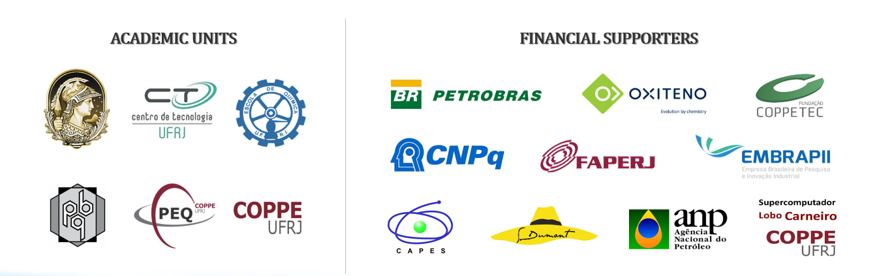

Applied Thermodynamics and Molecular Simulation {#mainpage}
===============================================

ATOMS (Applied Thermodynamics and Molecular Simulation) is a research group dedicated to the
development of theoretical, experimental, and computational tools in the fields of classical,
statistical, and irreversible thermodynamics, and to the application of these tools to the
solution of problems of both academic and industrial interest.

The group congregates [professors, researchers, and students](people.html) of two academic units
of the Federal University of Rio de Janeiro ([UFRJ]), Brazil:

* The School of Chemistry ([Escola de Quimica]), which has undergraduate programs in Chemical
Engineering, Bioprocess Engineering, Food Engineering, and Industrial Chemistry, as well as a
graduate program in Chemical & Biochemical Process Engineering ([EPQB]).

* The Alberto Luiz Coimbra Institute for Graduate Studies ([COPPE]), which coordinates several
graduate programs in engineering, including the Chemical Engineering Program ([PEQ]).

Research at ATOMS is supported by Brazilian public agencies such as the National Council for
Scientific and Technological Development ([CNPq]), the Coordination for the Improvement of Higher
Education Personnel ([CAPES]), and the State Research Funding Agency of Rio de Janeiro ([FAPERJ]).

We also receive support from Petrobras through its R&D funding program, regulated by the Brazilian
National Agency of Petroleum, Natural Gas and Biofuels ([ANP]), and from Oxiteno through the Brazilian
Agency for Industrial Research and Innovation ([EMBRAPII]).
We also thank the supercomputer research centers, Lobo Carneiro (from COPPE) and Santos Dumont
(from the Ministry of Science, Technology, Innovations and Communications).

@htmlonly
<iframe style="width:100%;height:600px" src="http://online.anyflip.com/czag/pcuh/"  seamless="seamless" scrolling="no" frameborder="0" allowtransparency="true" allowfullscreen="true" ></iframe>
@endhtmlonly

<!-- External links -->

[UFRJ]:			http://www.ufrj.br
[Escola de Quimica]:	http://www.eq.ufrj.br
[COPPE]:		http://www.coppe.ufrj.br/en
[EPQB]:			http://epqb.eq.ufrj.br
[PEQ]:			http://www.peq.coppe.ufrj.br/global/index.php/en
[CNPq]:			http://cnpq.br
[CAPES]:		http://www.capes.gov.br
[FAPERJ]:		http://www.faperj.br
[ANP]:			http://www.anp.gov.br
[EMBRAPII]:             https://www.embrapii.org.br/
