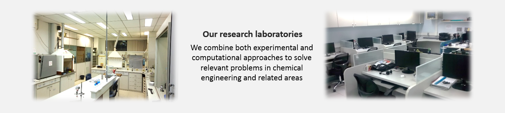

Applied Thermodynamics and Molecular Simulation {#mainpage}
===============================================

@htmlonly
<html>
<body>

<meta name="viewport" content="width=device-width, initial-scale=1">
<link rel="stylesheet" href="https://www.w3schools.com/w3cs
s/4/w3.css">
<body>

  

  
ATOMS (Applied Thermodynamics and Molecular Simulation) is a research group dedicated to the development of theoretical, experimental, and computational tools in the fields of classical, statistical, and irreversible thermodynamics, and to the application of these tools to the solution of problems of both academic and industrial interest.

  
The group congregates <a href="people.html">professors, researchers, and students</a> of two academic units of the Federal University of Rio de Janeiro (<a href="http://www.ufrj.br">UFRJ</a>), Brazil:

  <li>The School of Chemistry (<a href="http://www.eq.ufrj.br">Escola de Quimica</a>), which has undergraduate programs and a graduate program in Chemical &amp; Biochemical Process Engineering (<a href="http://epqb.eq.ufrj.br">EPQB</a>).</li>
  <li>The Alberto Luiz Coimbra Institute for Graduate Studies (<a href="http://www.coppe.ufrj.br/en">COPPE</a>), which coordinates several graduate programs in engineering, including the Chemical Engineering Program (<a href="http://www.peq.coppe.ufrj.br/global/index.php/en">PEQ</a>).</li>
  

  
  

     
  

  

     
     
     
     
</body>

<head>
  <meta charset="utf-8">
  <meta name="viewport">
  <link rel="stylesheet" href="https://maxcdn.bootstrapcdn.com/bootstrap/3.3.7/css/bootstrap.min.css">
  
  
</head>

<body>

  

  
    <!-- Indicators -->
    <ol class="carousel-indicators">
      <li data-target="#myCarousel" data-slide-to="0" class="active"></li>
      <li data-target="#myCarousel" data-slide-to="1"></li>
      <li data-target="#myCarousel" data-slide-to="2"></li>
    </ol>

    <!-- Wrapper for slides -->
    

      

        
      

      

        
      

    
      

        
      

    

    <!-- Left and right controls -->
    <a class="left carousel-control" href="#myCarousel" data-slide="prev">
      
      Previous
    </a>
    <a class="right carousel-control" href="#myCarousel" data-slide="next">
      
      Next
    </a>
  

</body>

<body>

<table>
  <tr>
    <td style="width:20%" align="center">
    </td>
    
    <td style="width:80%" align="center">
    
    </td>
    
    <td style="width:20%" align="center">
    </td>
    
</table>
</body>

<!-- <iframe style="width:100%;height:700px" src="http://online.anyflip.com/czag/pcuh/mobile"  seamless="seamless" scrolling="no" frameborder="0" allowtransparency="true" allowfullscreen="true" ></iframe>
-->

<iframe style="width:100%;height:700px" src="http://online.anyflip.com/fciiw/yowf/mobile"  seamless="seamless" scrolling="no" frameborder="0" allowtransparency="true" allowfullscreen="true" ></iframe>

</body>
</html>    
@endhtmlonly

<!-- External links -->

[UFRJ]:			http://www.ufrj.br
[Escola de Quimica]:	http://www.eq.ufrj.br
[COPPE]:		http://www.coppe.ufrj.br/en
[EPQB]:			http://epqb.eq.ufrj.br
[PEQ]:			http://www.peq.coppe.ufrj.br/global/index.php/en
[CNPq]:			http://cnpq.br
[CAPES]:		http://www.capes.gov.br
[FAPERJ]:		http://www.faperj.br
[ANP]:			http://www.anp.gov.br
[EMBRAPII]:             https://www.embrapii.org.br/
