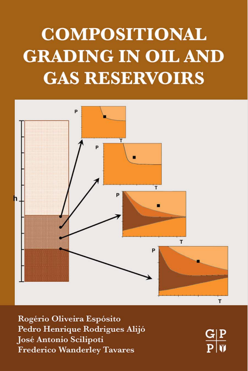

News {#news}
============

--------------------------------------------------------------------------------------------------------
Book: Compositional Grading in Oil and Gas Reservoirs
--------------------------------------------------------------------------------------------------------

* __Authors__: Rogerio Oliveira Esposito, Pedro Henrique Rodrigues Alijó, Jose Antonio Scilipoti and Frederico Wanderley Tavares
* __eBook ISBN__: 9780128124536
* __Paperback ISBN__: 9780128124529
* __Imprint__: Gulf Professional Publishing
* __Published Date__: 31st May 2017

Compositional Grading in Oil and Gas Reservoirs offers instruction, examples, and case studies on how to answer the challenges of modeling
a compositional gradient subject. Starting with the basics on PVT analysis, applied thermodynamics, and full derivations of irreversible 
thermodynamic-based equations, this critical reference explains gravity-modified equations to be applied to reservoirs, enabling engineers 
to obtain fluid composition at any point of the reservoir from measured data to create a stronger model calibration. The book combines practical
studies with the importance in modeling more complex phenomena, filling a gap for current and upcoming reservoir engineers to expand on solutions
and make sense of their reservoir’s output results. 
