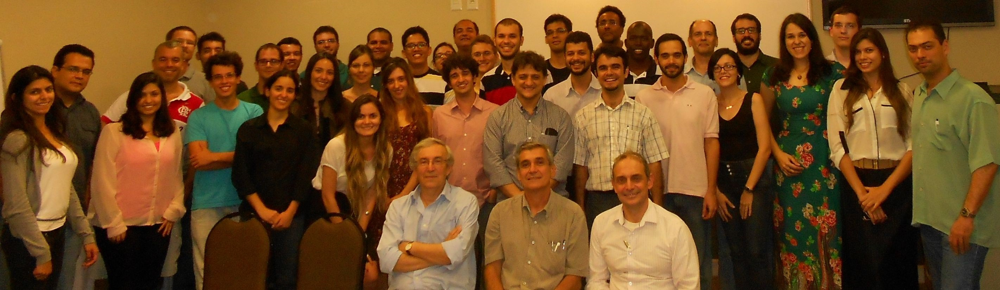

People {#people}
======

<!-- IMPORTANTE: O código que precede o nome de cada pesquisador abaixo é o mesmo código que aparece
na barra de endereço do navegador quando se visita o seu currículo lattes. Nunca acrescente um novo
nome nesta página sem precedê-lo pelo correspondente código.
-->

2nd ATOMS Annual Workshop - December 2013

<!------------------------------------------------------------------------------------------------->
@header: Academic Staff
<!------------------------------------------------------------------------------------------------->

K4787572D1
## Prof. Frederico W. Tavares
* Chemical Engineering Department - School of Chemistry - UFRJ
* Chemical Engineering Program - COPPE - UFRJ
* E-mail: tavares@eq.ufrj.br

K4763601J9
## Prof. Charlles R. A. Abreu
* Chemical Engineering Department - School of Chemistry - UFRJ
* E-mail: abreu@eq.ufrj.br

K4766494T6
## Prof. Heloisa L. Sanches
* Chemical Engineering Department - School of Chemistry - UFRJ
* E-mail: heloisa@eq.ufrj.br

K4763426D4
## Prof. Papa M. Ndiaye
* Chemical Engineering Department - School of Chemistry - UFRJ
* Chemical Engineering Program - COPPE - UFRJ
* E-mail: papa@eq.ufrj.br

K4765968P1
## Prof. Amaro Gomes Barreto Jr.
* Chemical Engineering Department - School of Chemistry - UFRJ
* E-mail: amaro@eq.ufrj.br

<!------------------------------------------------------------------------------------------------->
@end

<!------------------------------------------------------------------------------------------------->
@header: Research Assistants
<!------------------------------------------------------------------------------------------------->

K4338076H4
## Fernando de Azevedo Medeiros
* Chemical Engineering Department - School of Chemistry - UFRJ
* E-mail: fernando.medeiros01@gmail.com

K4238328Y0
## Vinicius Menez da Silva
* Chemical Engineering Department - School of Chemistry - UFRJ
* E-mail: viniciusmenez@yahoo.com.br

<!------------------------------------------------------------------------------------------------->
@end

<!------------------------------------------------------------------------------------------------->
@header: Postdoctoral Researchers
<!------------------------------------------------------------------------------------------------->

K4327048A3
## Carla Luciane Manske Camargo
* Thesis: **Emulsion Stability Study**
* Advisors: Frederico W. Tavares and Márcio Nele
* E-mail: cmanske@peq.coppe.ufrj.br

K4209625U4
## Rafael Mengotti Charin
* Thesis: **High Pressure Phase Behavior of Alphaltenes and Hydrates**
* Advisor: Frederico W. Tavares
* E-mail: rafaelcharin@yahoo.com.br

<!------------------------------------------------------------------------------------------------->
@end

<!------------------------------------------------------------------------------------------------->
@header: Ph.D. Students
<!------------------------------------------------------------------------------------------------->

K8562306D4
## Ana Jorgelina Silveira
* Thesis: **Molecular Design for Processing and Purification of Biomass Hydrolysates**
* Advisors: Selva Pereda and Charlles R. A. Abreu
* E-mail: asilveira@plapiqui.edu.ar

K4278078T5
## Ana Paula Palhares Simoncelli
* Thesis: **Thermodynamic Study of Asphaltene Precipitation**
* Advisors: Frederico W. Tavares and Papa M. Ndiaye
* E-mail: palhares@poli.ufrj.br

K4406651Z0
## Arthur Jesse Oliveira Braga
* Thesis: **High Pressure Phase Equilibria of Petroleum Heavy Fractions: Experimental and Thermodynamic Study**
* Advisors: Frederico W. Tavares and Papa M. Ndiaye
* E-mail: arthur.ufma@gmail.com

K4462773T4
## Fellipe Carvalho de Oliveira
* Thesis: **Structural, Dynamical and Rheological Characterization of Colloidal Suspensions via Molecular Simulation**
* Advisors: Frederico W. Tavares and João Manuel Luís Lopez Maia
* E-mail: fellipe.oliveira.ufc@gmail.com

K4413804P6
## Gabriel Duarte Barbosa
* Thesis: **Confined Fluids Modeling**
* Advisors: Frederico W. Tavares and Leonardo Travalloni
* E-mail: gdbarbosa@iq.urfj.br

K4361739E1
## Ingrid Azevedo de Oliveira
* Thesis: **Kinetic and Thermodynamic Analysis of the Formation of Hydrates**
* Advisors: Frederico W. Tavares and Amaro G. Barreto Jr.
* E-mail: ingrid.azevedo@ufrj.br

K4404224D3
## Iuri Soter Viana Segtovich
* Thesis: **Statistical Mechanics Modelling of Hydrate Nucleation and Growth Rates**
* Advisors: Frederico W. Tavares and Charlles R. A. Abreu
* E-mail: iurisegtovich@gmail.com

K4216699A9
## Jéssica Caroline da Silva Linhares
* Thesis: **Molecular Simulation of Rigid Molecules Aiming at Improving the COSMO-SAC Model**
* Advisors: Frederico W. Tavares and Charlles R. A. Abreu
* E-mail: jmaciel@peq.coppe.ufrj.br

K8124300E0
## Keerti Vardhan Sharma
* Thesis: **Double Population Cascaded Lattice Boltzmann Method for Thermal and Advection Diffusion Problems**
* Advisors: Frederico W. Tavares and Robert Straka (in collaboration with this project)
* E-mail: royalkeerti@hotmail.com

K4419572T6
## Marlon de Souza Gama
* Thesis: **Development of Electrostatic Models to Protein Adsorption by Modified Poisson-Boltzmann Equation**
* Advisors: Frederico W. Tavares and Amaro G. Barreto Jr.
* E-mail: marlongama@ufrj.br

K4298011A3
## Mirella Simões Santos
* Thesis: **Application of the Extended Poisson-Fermi-Nernst-Planck Approach for Colloidal and Proteic Systems**
* Advisors: Frederico W. Tavares and Evaristo C. Biscaia Jr.
* E-mail: mirella@peq.coppe.ufrj.br

K4431921D7
## Nathalia Salles Vernin Barbosa
* Thesis: **Study of Ion Partition in Biological Systems**
* Advisors: Eduardo R. A. Lima and Frederico W. Tavares
* E-mail: nathalia.vernin@gmail.com

K4384811P8
## Rafael Pereira do Carmo
* Thesis: **Modified SAFT Equation of State for Paraffin and Asphaltene Precipitation**
* Advisor: Frederico W. Tavares
* E-mail: rcarmo@peq.coppe.ufrj.br

K4426112D6
## Tiago Silva Miranda Lemos
* Thesis: **Molecular Dynamics of Self-Assembling Gradient Copolymers**
* Advisors: José Carlos Pinto and Charlles R. A. Abreu
* E-mail: tlemos@peq.coppe.ufrj.br

K4257847Z6
## Troner Assenheimer de Souza
* Thesis: **Emulsion Stability in the Presence of External Electric Fields**
* Advisors: Frederico W. Tavares and Márcio Nele de Souza
* E-mail: tassenheimer@gmail.com

<!------------------------------------------------------------------------------------------------->
@end

<!------------------------------------------------------------------------------------------------->
@header: Master's Degree Students
<!------------------------------------------------------------------------------------------------->

K8568991H6
## Diego Stone de Souza Aires
* Thesis: **Calculation Methods for Soret Coefficient in Compositional Grading Models for Petroleum Reservoirs**
* Advisors: Frederico W. Tavares and Charlles R. A. Abreu
* E-mail: dsaires@ufrj.br

K4338076H4
## Fernando de Azevedo Medeiros
* Thesis: **Thermodynamic Study of Hydrates Formation**
* Advisor: Frederico W. Tavares
* E-mail: fernando.medeiros01@gmail.com

K4428226U6
## Hermes Ribeiro Sant'Anna
* Thesis: **Numerical Simulation of N2 and CH4 Separation Through Adsorption in Silicalite**
* Advisors: Frederico W. Tavares and Amaro G. Barreto Jr.
* E-mail: hermes@eq.ufrj.br

K4331379J6
## Isabela Quintela Matos
* Thesis: **Determination of Partition Coefficients of Asphaltenes Type Molecules Through Molecular Simulation With SAFT-γ CG Mie Force Field**
* Advisors: Charlles R. A. Abreu and Papa M. Ndiaye
* E-mail: iquintelam@ufrj.br

K4432903H3
## José Rodrigues Torraca Neto
* Thesis: **Thermodynamic and Crystal Growth Analysis of FeCO3 in Solutions of H2O/MEG**
* Advisor: Amaro G. Barreto Jr.
* E-mail: joseneto@eq.ufrj.br

K4406302J9
## Karina Rodrigues Paiva Ranauro do Nascimento
* Thesis: **Molecular Modeling and Simulation of Strontium Fouling Inhibitors**
* Advisors: Charlles R. A. Abreu, Leonardo M. da Costa, and Peter Seidl
* E-mail: karinarpr@yahoo.com.br
 

K4331136Y5
## Maria Rosa Rocha Tenório Góes
* Thesis: **Simulation of Paraffin Precipitation in One-dimensional Two-Phase Flow**
* Advisors: Frederico W. Tavares and Argimiro R. Secchi
* E-mail: mgoes@peq.coppe.ufrj.br

K4368519A7
## Renata Cazelato Gaioto
* Thesis: **Kinetic and Thermodynamic Study of Drug Precipitation**
* Advisor: Frederico W. Tavares
* E-mail: renatacgaioto@gmail.com

K4478880A4
## Vítor de Morais Sermoud
* Thesis: **Development of Adsorption Models to Gaseous System**
* Advisors: Frederico W. Tavares and Amaro G. Barreto Jr.
* E-mail: vsermoud@gmail.com

<!------------------------------------------------------------------------------------------------->
@end

<!------------------------------------------------------------------------------------------------->
@header: Undergraduate Students
<!------------------------------------------------------------------------------------------------->

K8290410Y8
## Leonardo Tourasse Galdino
* Project: **Molecular Simulation of Drug Incorporation in a Multilayered Film of Polyelectrolytes**
* Advisor: Charlles R. A. Abreu
* E-mail: leotg1010@gmail.com

K8137399J3
## Mayk Caldas Ramos
* Project: **A Molecular Dynamics Analysis of Water on Zeolite**
* Advisors: Charlles R. A. Abreu and Amaro G. Barreto Jr.
* E-mail: maykcaldas@gmail.com

K4335171A2
## Thiago José Pinheiro dos Santos
* Project: **Obtaning Hydrocarbon Transport Properties using Molecular Simulation**
* Advisor: Frederico W. Tavares
* E-mail: pinheiro.thiagoj@gmail.com

<!------------------------------------------------------------------------------------------------->
@end

<!------------------------------------------------------------------------------------------------->
@header: Former members
<!------------------------------------------------------------------------------------------------->

K4772845D8
## Cassiano Gomes Aimoli
* Thesis: **Thermodynamic and Transport Properties of Methane and Carbon Dioxide: A Molecular Simulation Study**
* Advisors: Charlles R. A. Abreu and Edward J. Maginn
* E-mail: aimoli@petrobras.com.br

K4164770A8
## Cauê Torres de Oliveira Guedes Costa
* Thesis: **Equation of State Based on COSMO Quantum Chemistry Calculations**
* Advisors: Frederico W. Tavares and Argimiro R. Secchi
* E-mail: caue.costa@gmail.com

K4481961P9
## Dheiver Francisco Santos
* Project: **Properties of Mixtures Containing Protic Ionic Liquids. A Study of Specific Interactions**
* Advisors: Silvana Mattedi, Frederico W. Tavares, and Charlles R. A. Abreu
* E-mail: dheiver.santos@ufba.br

K4298461A4
## Filipe Arantes Furtado
* Thesis: **Experimental Determination and Non-Equilibrium Molecular Dynamics Simulation of Thermodiffusion Coefficients of Mixtures**
* Advisors: Frederico W. Tavares, Charlles R. A. Abreu, and Abbas Firoozabadi
* E-mail: filipe@peq.coppe.ufrj.br

K4348506E6
## Guilherme Carneiro Queiroz da Silva
* Thesis: **Solvent Effects of Dimethyl Sulfoxide on the Decarboxylation of Trichloroacetate**
* Advisors: Charlles R. A. Abreu and Thiago Messias Cardozo
* E-mail: gcarneiroq@gmail.com

K8265433Y5
## José Antonio Scilipoti
* Thesis: **Compositional Grading in Oil and Gas Reservoirs**
* Advisor: Frederico W. Tavares
* E-mail: jscilipoti@gmail.com

K4267155E4
## Pedro Henrique Rodrigues Alijó
* Thesis: **Steric and Electrostatic Correlation Effects on Ion Dynamics near Charged Electrodes**
* Advisors: Frederico W. Tavares and Evaristo C. Biscaia Jr.
* E-mail: pedroalijo@gmail.com

K4209625U4
## Rafael Mengotti Charin
* Thesis: **Emulsion Phase Inversion and Eletrical Properties in Oil Phase**
* Advisors: Frederico W. Tavares and Marcio Nele
* E-mail: rafaelcharin@yahoo.com.br

K8569592Z9
## Reinaldo Calderón Supelano
* Thesis: **Phase Equilibria and Thermodynamic Stability in Multiphase Flashes**
* Advisors: Frederico W. Tavares and Argimiro R. Secchi
* E-mail: reinaldocalderon.s@gmail.com

K4451104E6
## Tatiana Pitchon Sampaio
* Thesis: **Bivariate Population Balance Model for Hydrate Formation Considering Mass and Heat Transfer Limitations**
* Advisors: Frederico W. Tavares and Paulo L. C. Lage
* E-mail: tpitchon@gmail.com

@end

