People {#people}
======

<!-- IMPORTANTE: O código que precede o nome de cada pesquisador abaixo é o mesmo código que aparece
na barra de endereço do navegador quando se visita o seu currículo lattes. Nunca acrescente um novo
nome nesta página sem precedê-lo pelo correspondente código.
-->

<!-- 
ATOMS team, November, 2018
 -->

<!------------------------------------------------------------------------------------------------->
<table id="gradient-style-large"><tr><th></th><th><h2> Academic Staff</h2></th></tr><tr><td></td><td>
<!------------------------------------------------------------------------------------------------->

@htmlonly
</td></tr><tr><td><a href="http://buscatextual.cnpq.br/buscatextual/visualizacv.do?id=K4787572D1" target="_blank" title="Curriculum vitae">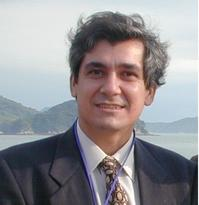</a></td><td>
@endhtmlonly
## Prof. Frederico W. Tavares
* Chemical Engineering Department - School of Chemistry - UFRJ
* Chemical Engineering Program - COPPE - UFRJ
* E-mail: tavares@eq.ufrj.br

@htmlonly
</td></tr><tr><td><a href="http://buscatextual.cnpq.br/buscatextual/visualizacv.do?id=K4763601J9" target="_blank" title="Curriculum vitae">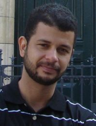</a></td><td>
@endhtmlonly
## Prof. Charlles R. A. Abreu
* Chemical Engineering Department - School of Chemistry - UFRJ
* E-mail: abreu@eq.ufrj.br

@htmlonly
</td></tr><tr><td><a href="http://buscatextual.cnpq.br/buscatextual/visualizacv.do?id=K4763426D4" target="_blank" title="Curriculum vitae">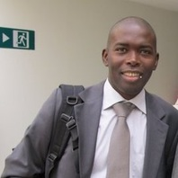</a></td><td>
@endhtmlonly
## Prof. Papa M. Ndiaye
* Chemical Engineering Department - School of Chemistry - UFRJ
* Chemical Engineering Program - COPPE - UFRJ
* E-mail: papa@eq.ufrj.br

@htmlonly
</td></tr><tr><td><a href="http://buscatextual.cnpq.br/buscatextual/visualizacv.do?id=K4765968P1" target="_blank" title="Curriculum vitae">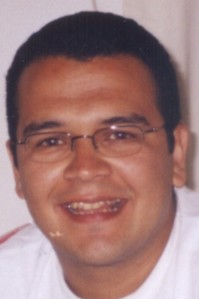</a></td><td>
@endhtmlonly
## Prof. Amaro Gomes Barreto Jr.
* Chemical Engineering Department - School of Chemistry - UFRJ
* E-mail: amaro@eq.ufrj.br

@htmlonly
</td></tr><tr><td></td><td>
@endhtmlonly
## Carla Luciane Manske Camargo
* Chemical Engineering Department - School of Chemistry - UFRJ
* E-mail: carlamanske@eq.ufrj.br

<!------------------------------------------------------------------------------------------------->
</td></tr></table>

<!------------------------------------------------------------------------------------------------->
<table id="gradient-style-large"><tr><th></th><th><h2> Research Assistants</h2></th></tr><tr><td></td><td>
<!------------------------------------------------------------------------------------------------->

@htmlonly
</td></tr><tr><td></td><td>
@endhtmlonly
## Amanda Gerhardt de Oliveira Ferreira
* Chemical Engineering Department - School of Chemistry - UFRJ
* E-mail: agerhardt@peq.coppe.ufrj.br

<!------------------------------------------------------------------------------------------------->
</td></tr></table>

<!------------------------------------------------------------------------------------------------->
<table id="gradient-style-large"><tr><th></th><th><h2> Postdoctoral Researchers</h2></th></tr><tr><td></td><td>
<!------------------------------------------------------------------------------------------------->

@htmlonly
</td></tr><tr><td><a href="http://buscatextual.cnpq.br/buscatextual/visualizacv.do?id=K4413804P6" target="_blank" title="Curriculum vitae">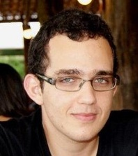</a></td><td>
@endhtmlonly
## Gabriel Duarte Barbosa
* Thesis: **Confined Fluids Modeling**
* Advisors: Frederico W. Tavares and Leonardo Travalloni
* E-mail: gdbarbosa@eq.ufrj.br

@htmlonly
</td></tr><tr><td></td><td>
@endhtmlonly
## Jéssica Caroline da Silva Linhares Maciel
* Thesis: **Calculation of Residual Chemical Potential of Rigid Molecules by Monte Carlo Molecular Simulation**
* Advisors: Frederico W. Tavares and Charlles R. A. Abreu
* E-mail: jmaciel@peq.coppe.ufrj.br

@htmlonly
</td></tr><tr><td><a href="http://buscatextual.cnpq.br/buscatextual/visualizacv.do?id=K8627879P1" target="_blank" title="Curriculum vitae">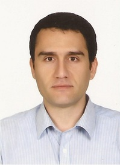</a></td><td>
@endhtmlonly
## Khalil Kashefi
* Thesis: **Dehydration of Natural Gas by Adsorption - Evaluation of Properties and Conditions of Operation**
* Advisors: Amaro Gomes Barreto Jr. and Frederico W. Tavares
* E-mail: khalil.kashefi@eq.ufrj.br

@htmlonly
</td></tr><tr><td></td><td>
@endhtmlonly
## Keerti Vardhan Sharma
* Thesis: **Double Population Cascaded Lattice Boltzmann Method for Thermal and Advection Diffusion Problems**
* Advisors: Frederico W. Tavares and Robert Straka (in collaboration with this project)
* E-mail: royalkeerti@hotmail.com

@htmlonly
</td></tr><tr><td></td><td>
@endhtmlonly
## Troner Assenheimer de Souza
* Thesis: **Study of the Influence of the Frequency of Electric Fields on Improving the Separation of Water-in-Oil Emulsions**
* Advisors: Edson Hirokazu Watanabe, Frederico W. Tavares and Márcio Nele de Souza
* E-mail: tassenheimer@gmail.com

<!------------------------------------------------------------------------------------------------->
</td></tr></table>

<!------------------------------------------------------------------------------------------------->
<table id="gradient-style-large"><tr><th></th><th><h2> Ph.D. Students</h2></th></tr><tr><td></td><td>
<!------------------------------------------------------------------------------------------------->

@htmlonly
</td></tr><tr><td><a href="http://buscatextual.cnpq.br/buscatextual/visualizacv.do?id=K4794358H6" target="_blank" title="Curriculum vitae">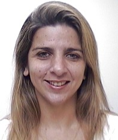</a></td><td>
@endhtmlonly
## Adriana Teixeira
* Thesis: **Evaluation of the Agglomeration Process of Gas Hydrates in the Presence of Salts and Surfactants**
* Advisors: Frederico W. Tavares and Amaro Gomes Barreto Jr.
* E-mail: adriteix@petrobras.com.br and adriteix@yahoo.com.br

@htmlonly
</td></tr><tr><td><a href="http://buscatextual.cnpq.br/buscatextual/visualizacv.do?id=K8323782A7" target="_blank" title="Curriculum vitae">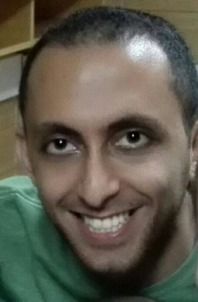</a></td><td>
@endhtmlonly
## Ali Khajehesamedini
* Thesis: **Development of Aggregation Kernel for the Electrocoalescency Process**
* Advisor: Frederico W. Tavares
* E-mail: alikhajehesamedini@gmail.com

@htmlonly
</td></tr><tr><td><a href="http://buscatextual.cnpq.br/buscatextual/visualizacv.do?id=K4278078T5" target="_blank" title="Curriculum vitae">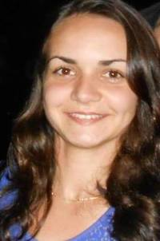</a></td><td>
@endhtmlonly
## Ana Paula Palhares Simoncelli
* Thesis: **Thermodynamic Study of Asphaltene Precipitation**
* Advisors: Frederico W. Tavares and Papa M. Ndiaye
* E-mail: palhares@poli.ufrj.br

@htmlonly
</td></tr><tr><td></td><td>
@endhtmlonly
## Arthur Jesse Oliveira Braga
* Thesis: **High Pressure Phase Equilibria of Petroleum Heavy Fractions: Experimental and Thermodynamic Study**
* Advisors: Frederico W. Tavares and Papa M. Ndiaye
* E-mail: arthur.ufma@gmail.com

@htmlonly
</td></tr><tr><td></td><td>
@endhtmlonly
## Cliff Iuri de Souza Gonçalves
* Thesis: **Determination of Transport Properties from Systems at Supercritical Conditions**
* Advisors: Frederico W. Tavares and Papa M. Ndiaye
* E-mail: cliff@peq.coppe.ufrj.br

@htmlonly
</td></tr><tr><td></td><td>
@endhtmlonly
## Fellipe Carvalho de Oliveira
* Thesis: **Structural, Dynamical and Rheological Characterization of Colloidal Suspensions via Molecular Simulation**
* Advisors: Frederico W. Tavares and João Manuel Luís Lopez Maia
* E-mail: fellipe.oliveira.ufc@gmail.com

@htmlonly
</td></tr><tr><td></td><td>
@endhtmlonly
## Ingrid Azevedo de Oliveira
* Thesis: **Kinetic and Thermodynamic Analysis of the Formation of Hydrates**
* Advisors: Frederico W. Tavares and Amaro G. Barreto Jr.
* E-mail: ingrid.azevedo@ufrj.br

@htmlonly
</td></tr><tr><td></td><td>
@endhtmlonly
## Iuri Soter Viana Segtovich
* Thesis: **Thermodynamic Modeling of Compressible Hydrates and Calculations of Multiphase Equilibrium Diagrams**
* Advisors: Frederico W. Tavares and Charlles R. A. Abreu
* E-mail: iurisegtovich@gmail.com

@htmlonly
</td></tr><tr><td><a href="http://buscatextual.cnpq.br/buscatextual/visualizacv.do?id=K4432903H3" target="_blank" title="Curriculum vitae">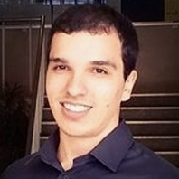</a></td><td>
@endhtmlonly
## José Rodrigues Torraca Neto
* Thesis: **Thermodynamic and Crystal Growth Analysis of FeCO3 in Solutions of H2O/MEG**
* Advisor: Amaro G. Barreto Jr.
* E-mail: joseneto@eq.ufrj.br

@htmlonly
</td></tr><tr><td><a href="http://buscatextual.cnpq.br/buscatextual/visualizacv.do?id=K8728144A8" target="_blank" title="Curriculum vitae">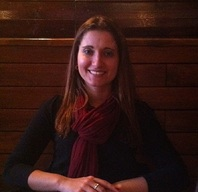</a></td><td>
@endhtmlonly
## Lívia Braga Meirelles
* Thesis: **Phase Equilibria of heavy oil fraction and Carbon Dioxide at High Pressure**
* Advisors: Erika Christina Ashton N. Chrisman and Papa Matar Ndiaye
* E-mail: livia@eq.ufrj.br

@htmlonly
</td></tr><tr><td></td><td>
@endhtmlonly
## Maria Rosa Rocha Tenório Góes
* Thesis: **Simulation of Paraffin Precipitation in One-dimensional Two-Phase Flow**
* Advisors: Frederico W. Tavares and Argimiro R. Secchi
* E-mail: mgoes@peq.coppe.ufrj.br

@htmlonly
</td></tr><tr><td></td><td>
@endhtmlonly
## Marlon de Souza Gama
* Thesis: **Development of Electrostatic Models to Protein Adsorption by Modified Poisson-Boltzmann Equation**
* Advisors: Frederico W. Tavares and Amaro Gomes Barreto Jr.
* E-mail: marlongama@ufrj.br

@htmlonly
</td></tr><tr><td></td><td>
@endhtmlonly
## Monique Lombardo de Almeida
* Thesis: **Stability of Water-in-Oil Emulsions in the Presence of External Fields**
* Advisors: Frederico W. Tavares and Márcio Nele de Souza
* E-mail: lombardo.monique@gmail.com

@htmlonly
</td></tr><tr><td><a href="http://buscatextual.cnpq.br/buscatextual/visualizacv.do?id=K4431921D7" target="_blank" title="Curriculum vitae">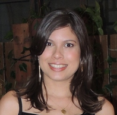</a></td><td>
@endhtmlonly
## Nathalia Salles Vernin Barbosa
* Thesis: **Study of Ion Partition in Biological Systems**
* Advisors: Eduardo R. A. Lima and Frederico W. Tavares
* E-mail: nathalia.vernin@gmail.com

@htmlonly
</td></tr><tr><td><a href="http://buscatextual.cnpq.br/buscatextual/visualizacv.do?id=K4457388H9" target="_blank" title="Curriculum vitae">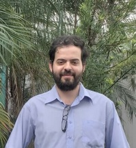</a></td><td>
@endhtmlonly
## Rafael Cavalcante dos Santos
* Thesis: **Development of Mathematical Model for Description of Diffusive Transport Phenomena and Adsorption Equilibrium on Process of Production and Separation of Propionic Acid**
* Advisor: Amaro Gomes Barreto Jr., Frederico W. Tavares and Nei Pereira Junior
* E-mail: rafaelcavalcante.santos@hotmail.com

@htmlonly
</td></tr><tr><td><a href="http://buscatextual.cnpq.br/buscatextual/visualizacv.do?id=K4384811P8" target="_blank" title="Curriculum vitae">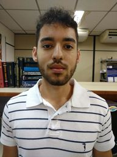</a></td><td>
@endhtmlonly
## Rafael Pereira do Carmo
* Thesis: **Development of Equation of State for Solid Phases Via Perturbation Theory**
* Advisor: Frederico W. Tavares
* E-mail: rcarmo@peq.coppe.ufrj.br

@htmlonly
</td></tr><tr><td></td><td>
@endhtmlonly
## Reinaldo Calderón Supelano
* Thesis: **Nonlinear Predictive Control of a Simulated Moving Beg Unit**
* Advisors: Argimiro R. Secchi and Amaro Gomes Barreto Jr.
* E-mail: reinaldo@peq.coppe.ufrj.br

@htmlonly
</td></tr><tr><td></td><td>
@endhtmlonly
## Thales Cainã dos Santos Barbalho
* Thesis: **Water Content Determination in Natural Gas Streams**
* Advisors: Frederico W. Tavares and Papa M. Ndiaye
* E-mail: thales@peq.coppe.ufrj.br

@htmlonly
</td></tr><tr><td><a href="http://buscatextual.cnpq.br/buscatextual/visualizacv.do?id=K4426112D6" target="_blank" title="Curriculum vitae">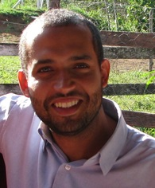</a></td><td>
@endhtmlonly
## Tiago Silva Miranda Lemos
* Thesis: **Molecular Dynamics of Self-Assembling Gradient Copolymers**
* Advisors: José Carlos Pinto and Charlles R. A. Abreu
* E-mail: tlemos@peq.coppe.ufrj.br

@htmlonly
</td></tr><tr><td><a href="http://buscatextual.cnpq.br/buscatextual/visualizacv.do?id=K8499866E1" target="_blank" title="Curriculum vitae">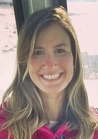</a></td><td>
@endhtmlonly
## Vanessa Pimentel Lages
* Thesis: **Theoretical-Experimental Evaluation of the Use of Magnetic Devices in the Precipitation of Calcium Carbonate in Pipes**
* Advisor: Amaro Gomes Barreto Jr.
* E-mail: vanessaplages@hotmail.com

@htmlonly
</td></tr><tr><td></td><td>
@endhtmlonly
## Vinicius Menez da Silva
* Thesis: **Thermodynamic Study of Paraffin Precipitation**
* Advisors: Frederico W. Tavares and Papa M. Ndiaye
* E-mail: viniciusmenez@yahoo.com.br

@htmlonly
</td></tr><tr><td></td><td>
@endhtmlonly
## Vítor de Morais Sermoud
* Thesis: **Development of Adsorption Models to Gaseous System**
* Advisors: Frederico W. Tavares and Amaro Gomes Barreto Jr.
* E-mail: vsermoud@gmail.com

<!------------------------------------------------------------------------------------------------->
</td></tr></table>

<!------------------------------------------------------------------------------------------------->
<table id="gradient-style-large"><tr><th></th><th><h2> Master's Degree Students</h2></th></tr><tr><td></td><td>
<!------------------------------------------------------------------------------------------------->
@htmlonly
</td></tr><tr><td></td><td>
@endhtmlonly
## Aluan Andrade Ferreira
* Thesis: **Thermodynamics of Confined Fluids Using Density Functional Theory**
* Advisors: Frederico W. Tavares and Gabriel Duarte Barbosa
* E-mail: aluan@eq.ufrj.br

<!-- 
K 4498086D5 - Não tem foto no Lattes
## Bruno Miranda Nogueira
* Thesis: **Phase equilibria of systems containing glycerol, methanol, carbon dioxide and sodium Chloride**
* Advisors: Papa M. Ndiaye and Frederico W. Tavares
* E-mail: nogueirab@gmail.com
-->

@htmlonly
</td></tr><tr><td><a href="http://buscatextual.cnpq.br/buscatextual/visualizacv.do?id=K4407408T6" target="_blank" title="Curriculum vitae">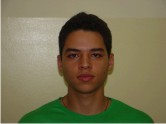</a></td><td>
@endhtmlonly
## Caio Rodrigues Soares
* Thesis: **Molecular Dynamics Calculation of Hydration Properties in Calcium Carbonate Clusters**
* Advisors: Amaro Gomes Barreto Jr. and Frederico W. Tavares
* E-mail: caio_equi@hotmail.com

@htmlonly
</td></tr><tr><td></td><td>
@endhtmlonly
## Felipe Eduardo Braun
* Thesis: **Modeling and Optimization of Fixed Bed Natural Gas Dehydration Units**
* Advisors: Argimiro Resende Secchi and Amaro Gomes Barreto Jr.
* E-mail: braun.ime@gmail.com

@htmlonly
</td></tr><tr><td></td><td>
@endhtmlonly
## Gerson Francisco da Silva Junior
* Thesis: **Study of Phase Equilibrium to Predict Scale Deposition of CaCO3**
* Advisor: Amaro Gomes Barreto Jr.
* E-mail: gersonsf.junior@gmail.com

@htmlonly
</td></tr><tr><td></td><td>
@endhtmlonly
## Hugo Candia Saad
* Thesis: **Thermodynamic Properties of CO2 in Mixtures of Natural Gas and Water**
* Advisors: Papa M. Ndiaye and Frederico W. Tavares
* E-mail: hugo_saad@hotmail.com

@htmlonly
</td></tr><tr><td></td><td>
@endhtmlonly
## Mariana Amorim de Almeida
* Thesis: **Extension of an Equation of State to the Modeling of Confined Fluids**
* Advisors: Frederico W. Tavares and Leonardo Travalloni
* E-mail: almeida@eq.ufrj.br

@htmlonly
</td></tr><tr><td></td><td>
@endhtmlonly
## Sâmia Nara Santos Vasconcelos
* Project: **Simulation and Optimization of the Process of Dehydration of Natural Gas by Adsorption**
* Advisors: Amaro Gomes Barreto Jr. and Argimiro R. Secchi
* E-mail: nara_samia@hotmail.com

@htmlonly
</td></tr><tr><td></td><td>
@endhtmlonly
## Tetsuo Mineiro Miyakawa
* Project: **Methodology for Compositional Distribution in Oil Fields With Compositional Grading**
* Advisors: Frederico W. Tavares and Rogerio Espósito
* E-mail: tetmm9@gmail.com

@htmlonly
</td></tr><tr><td><a href="http://buscatextual.cnpq.br/buscatextual/visualizacv.do?id=K4335171A2" target="_blank" title="Curriculum vitae">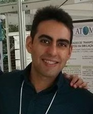</a></td><td>
@endhtmlonly
## Thiago José Pinheiro dos Santos
* Project: **Determination of Transport Coefficients of CO2 and n-alkanes Mixtures Under Reservoir Conditions Using Molecular Dynamics**
* Advisors: Frederico W. Tavares and Charlles R. A. Abreu
* E-mail: pinheiro.thiagoj@gmail.com

@htmlonly
</td></tr><tr><td><a href="http://buscatextual.cnpq.br/buscatextual/visualizacv.do?id=K4492453P5" target="_blank" title="Curriculum vitae">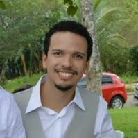</a></td><td>
@endhtmlonly
## Túlio Alves Freire
* Project: **PVT Modeling Applied to Confined Fluids**
* Advisor: Frederico W. Tavares
* E-mail: tulio-freire@hotmail.com

@htmlonly
</td></tr><tr><td></td><td>
@endhtmlonly
## Vanessa Andrea Mascietti
* Project: **Solubility of Monoethyleneglycol (MEG) in n-pentane in the Presence of Ethanol/Methanol: Experimental Study and Thermodynamic Modeling**
* Advisors: Papa Matar Ndiaye and Frederico W. Tavares
* E-mail: vanessa_mascietti05@hotmail.com

@htmlonly
</td></tr><tr><td></td><td>
@endhtmlonly
## Yamara Matos Oliveira
* Thesis: **Calculations of Transport Properties of Confined Fluid Via Molecular Dynamics**
* Advisors: Charlles R. A. Abreu and Frederico W. Tavares
* E-mail: yamaramatos@gmail.com

@htmlonly
</td></tr><tr><td><a href="http://buscatextual.cnpq.br/buscatextual/visualizacv.do?id=K8073148E6" target="_blank" title="Curriculum vitae">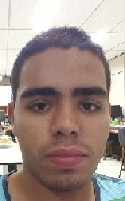</a></td><td>
@endhtmlonly
## Wilfred Andres Gomez Jaramillo
* Thesis: **High Pressure Phase Equilibria of Parafinic Systems: Experimental and Thermodynamic Study**
* Advisors: Frederico W. Tavares and Papa M. Ndiaye
* E-mail: wilfredjara@gmail.com

<!------------------------------------------------------------------------------------------------->
</td></tr></table>

<!------------------------------------------------------------------------------------------------->
<table id="gradient-style-large"><tr><th></th><th><h2> Undergraduate Students</h2></th></tr><tr><td></td><td>
<!------------------------------------------------------------------------------------------------->

@htmlonly
</td></tr><tr><td><a href="http://buscatextual.cnpq.br/buscatextual/visualizacv.do?id=K8694587J3" target="_blank" title="Curriculum vitae">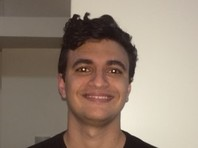</a></td><td>
@endhtmlonly
## Arthur Mussi Luz
* Project: **Calculation of Properties of Deep Eutectic Solvents by Molecular Dynamics Simulation**
* Advisors: Charlles R. A. Abreu and Jéssica C. S. L. Maciel
* E-mail: arthur_mussi@eq.ufrj.br

@htmlonly
</td></tr><tr><td></td><td>
@endhtmlonly
## Breno Cassaro Mourão
* Project: **Application of Multistate Methods to Compute Property Profiles of Deep Eutectic Solvents by Molecular Simulation**
* Advisor: Charlles R. A. Abreu
* E-mail: b.c.mquim@gmail.com

<!--
K 4323172P3 - Não tem foto no Lattes
## Gabriel Moraes Silva
* Project: **Renormalization Group Theory applied to Equations of State**
* Advisors: Frederico W. Tavares and Charlles R. A. Abreu
* E-mail: silvagm.br@gmail.com
-->

@htmlonly
</td></tr><tr><td><a href="http://buscatextual.cnpq.br/buscatextual/visualizacv.do?id=K4362066Z2" target="_blank" title="Curriculum vitae">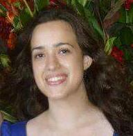</a></td><td>
@endhtmlonly
## Gabriela Freire de Arruda
* Project: **Modeling and Simulation of Monoclonal Antibodies for Purification in Ion Exchange Columns**
* Advisor: Amaro Gomes Barreto Jr.
* E-mail: gfa.gabriela@gmail.com

@htmlonly
</td></tr><tr><td><a href="http://buscatextual.cnpq.br/buscatextual/visualizacv.do?id=K2754085J3" target="_blank" title="Curriculum vitae">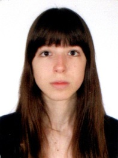</a></td><td>
@endhtmlonly
## Giovanna Mandarino Vieira
* Project: **Estimation of parameters in crystallization processes**
* Advisors: Argimiro Resende Secchi and Amaro Gomes Barreto Jr.
* E-mail: giomandavieira@gmail.com

@htmlonly
</td></tr><tr><td></td><td>
@endhtmlonly
## Leonardo Tourasse Galdino
* Project: **Molecular Simulation of Drug Incorporation in a Multilayered Film of Polyelectrolytes**
* Advisor: Charlles R. A. Abreu
* E-mail: leotg1010@gmail.com

<!------------------------------------------------------------------------------------------------->
</td></tr></table>

<!------------------------------------------------------------------------------------------------->
<table id="gradient-style-large"><tr><th></th><th><h2> Former members</h2></th></tr><tr><td></td><td>
<!------------------------------------------------------------------------------------------------->

@htmlonly
</td></tr><tr><td><a href="http://buscatextual.cnpq.br/buscatextual/visualizacv.do?id=K8562306D4" target="_blank" title="Curriculum vitae">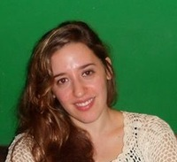</a></td><td>
@endhtmlonly
## Ana Jorgelina Silveira
* Thesis: **Sampling Strategies in Molecular Simulation with Rigid Bodies: Critical Evaluation and Application to Solvation Free Energy Calculations**
* Advisors: Selva Pereda and Charlles R. A. Abreu
* E-mail: asilveira@plapiqui.edu.ar

@htmlonly
</td></tr><tr><td></td><td>
@endhtmlonly
## Cassiano Gomes Aimoli
* Thesis: **Thermodynamic and Transport Properties of Methane and Carbon Dioxide: A Molecular Simulation Study**
* Advisors: Charlles R. A. Abreu and Edward J. Maginn
* E-mail: aimoli@petrobras.com.br

@htmlonly
</td></tr><tr><td><a href="http://buscatextual.cnpq.br/buscatextual/visualizacv.do?id=K4164770A8" target="_blank" title="Curriculum vitae">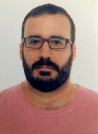</a></td><td>
@endhtmlonly
## Cauê Torres de Oliveira Guedes Costa
* Thesis: **Equation of State Based on COSMO Quantum Chemistry Calculations**
* Advisors: Frederico W. Tavares and Argimiro R. Secchi
* E-mail: caue.costa@gmail.com

@htmlonly
</td></tr><tr><td></td><td>
@endhtmlonly
## Diego Stone de Souza Aires
* Thesis: **Calculation Methods for Soret Coefficient in Compositional Grading Models for Petroleum Reservoirs**
* Advisors: Frederico W. Tavares and Charlles R. A. Abreu
* E-mail: dsaires@ufrj.br

@htmlonly
</td></tr><tr><td></td><td>
@endhtmlonly
## Fernando de Azevedo Medeiros
* Thesis: **Hydrate Enthalpy of Dissociation from Statistical Thermodynamics**
* Advisors: Frederico W. Tavares and Amaro Gomes Barreto Jr.
* E-mail: fernando.medeiros01@gmail.com

@htmlonly
</td></tr><tr><td><a href="http://buscatextual.cnpq.br/buscatextual/visualizacv.do?id=K4298461A4" target="_blank" title="Curriculum vitae">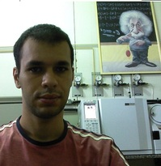</a></td><td>
@endhtmlonly
## Filipe Arantes Furtado
* Thesis: **Experimental Determination and Non-Equilibrium Molecular Dynamics Simulation of Thermodiffusion Coefficients of Mixtures**
* Advisors: Frederico W. Tavares, Charlles R. A. Abreu and Abbas Firoozabadi
* E-mail: ffurtado@ufrrj.br and arantes.filipe@gmail.com

@htmlonly
</td></tr><tr><td><a href="http://buscatextual.cnpq.br/buscatextual/visualizacv.do?id=K4348506E6" target="_blank" title="Curriculum vitae">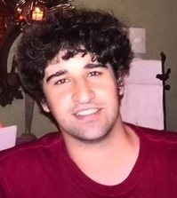</a></td><td>
@endhtmlonly
## Guilherme Carneiro Queiroz da Silva
* Thesis: **Solvent Effects of Dimethyl Sulfoxide on the Decarboxylation of Trichloroacetate**
* Advisors: Charlles R. A. Abreu and Thiago Messias Cardozo
* E-mail: gcarneiroq@gmail.com

@htmlonly
</td></tr><tr><td><a href="http://buscatextual.cnpq.br/buscatextual/visualizacv.do?id=K4428226U6" target="_blank" title="Curriculum vitae">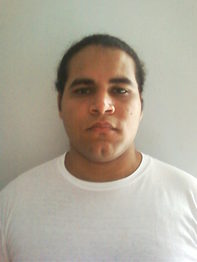</a></td><td>
@endhtmlonly
## Hermes Ribeiro Sant'Anna
* Thesis: **Numerical Simulation of N2 and CH4 Separation Through Adsorption in Silicalite**
* Advisors: Frederico W. Tavares and Amaro G. Barreto Jr.
* E-mail: hermes@eq.ufrj.br

@htmlonly
</td></tr><tr><td></td><td>
@endhtmlonly
## Isabela Quintela Matos
* Thesis: **Determination of Partition Coefficients of Asphaltenes Type Molecules Through Molecular Simulation With SAFT-γ CG Mie Force Field**
* Advisors: Charlles R. A. Abreu and Papa M. Ndiaye
* E-mail: iquintelam@ufrj.br

@htmlonly
</td></tr><tr><td></td><td>
@endhtmlonly
## José Antonio Scilipoti
* Thesis: **Compositional Grading in Oil and Gas Reservoirs**
* Advisor: Frederico W. Tavares
* E-mail: jscilipoti@gmail.com

@htmlonly
</td></tr><tr><td></td><td>
@endhtmlonly
## Karina Rodrigues Paiva Ranauro do Nascimento
* Thesis: **Molecular Modeling and Simulation of Strontium Fouling Inhibitors**
* Advisors: Charlles R. A. Abreu, Leonardo M. da Costa, and Peter Seidl
* E-mail: karinarpr@yahoo.com.br

@htmlonly
</td></tr><tr><td><a href="http://buscatextual.cnpq.br/buscatextual/visualizacv.do?id=K4777258Y8" target="_blank" title="Curriculum vitae">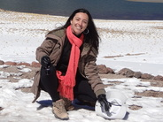</a></td><td>
@endhtmlonly
## Letícia Cotia dos Santos
* Thesis: **An Association Model to Calculate Phase Equilibria of Complex Mixtures With Focus in the Natural Gas Processing**
* Advisors: Frederico W. Tavares, Victor Rolando Ruiz Ahón and Georgios M. Kontogeorgis
* E-mail: leticia@peq.coppe.ufrj.br

@htmlonly
</td></tr><tr><td></td><td>
@endhtmlonly
## Mayk Caldas Ramos
* Project: **A Molecular Dynamics Analysis of Water on Zeolite**
* Advisors: Charlles R. A. Abreu and Amaro G. Barreto Jr.
* E-mail: maykcaldas@gmail.com

@htmlonly
</td></tr><tr><td></td><td>
@endhtmlonly
## Mirella Simões Santos
* Thesis: **Application of the Extended Poisson-Fermi-Nernst-Planck Approach for Colloidal and Proteic Systems**
* Advisors: Frederico W. Tavares and Evaristo C. Biscaia Jr.
* E-mail: mirella@peq.coppe.ufrj.br

@htmlonly
</td></tr><tr><td><a href="http://buscatextual.cnpq.br/buscatextual/visualizacv.do?id=K4267155E4" target="_blank" title="Curriculum vitae">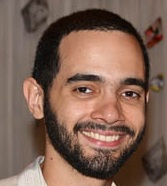</a></td><td>
@endhtmlonly
## Pedro Henrique Rodrigues Alijó
* Thesis: **Steric and Electrostatic Correlation Effects on Ion Dynamics near Charged Electrodes**
* Advisors: Frederico W. Tavares and Evaristo C. Biscaia Jr.
* E-mail: pedroalijo@gmail.com

@htmlonly
</td></tr><tr><td></td><td>
@endhtmlonly
## Rafael Mengotti Charin
* Thesis: **Emulsion Phase Inversion and Eletrical Properties in Oil Phase**
* Advisors: Frederico W. Tavares and Marcio Nele
* E-mail: rafaelcharin@yahoo.com.br

@htmlonly
</td></tr><tr><td><a href="http://buscatextual.cnpq.br/buscatextual/visualizacv.do?id=K4368519A7" target="_blank" title="Curriculum vitae">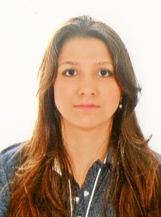</a></td><td>
@endhtmlonly
## Renata Cazelato Gaioto
* Thesis: **Kinetic and Thermodynamic Study of Drug Precipitation**
* Advisor: Frederico W. Tavares
* E-mail: renatacgaioto@gmail.com

@htmlonly
</td></tr><tr><td><a href="http://buscatextual.cnpq.br/buscatextual/visualizacv.do?id=K4208759D4" target="_blank" title="Curriculum vitae">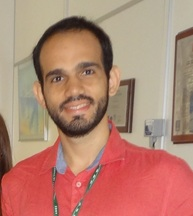</a></td><td>
@endhtmlonly
## Samir Silva Abunahman
* Thesis: **A Computational Tool for Equations of State Parameter Estimation: Phase Equilibria Calculations and Industrial Dehydration Unit Operation Analysis**
* Advisors: Frederico W. Tavares and Letícia Cotia dos Santos
* E-mail: samir@peq.coppe.ufrj.br and samir.abu@gmail.com

@htmlonly
</td></tr><tr><td></td><td>
@endhtmlonly
## Tatiana Pitchon Sampaio
* Thesis: **Bivariate Population Balance Model for Hydrate Formation Considering Mass and Heat Transfer Limitations**
* Advisors: Frederico W. Tavares and Paulo L. C. Lage
* E-mail: tpitchon@gmail.com

</td></tr></table>

